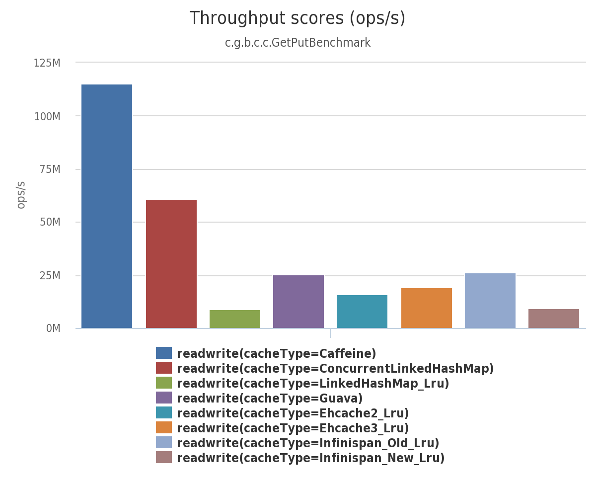

# 基准

基准测试是用[java microbenchmark harness](http://openjdk.java.net/projects/code-tools/jmh/)(即jmh,如果想看中文的也可以查看[这里](https://vitzhou.gitbooks.io/jmh-learning/content/))来提供准确的分析.缓存被配置为:
- Caffeine和ConcurrentLinkedHashMap根据CPU数量来调整内部结构的大小
- Guava配置的并发级别为64（默认为4，以减少内存使用量）。 请注意，Guava[＃2063](https://github.com/google/guava/issues/2063#issuecomment-107169736)可以解决性能不佳的问题(可以提升25倍！),但是已经积压了多年没有解决。
- Ehcache v2内部硬编码为100 segments，而v3没有分段.
- Infinispan“old”是一个类似Guava的缓存，配置的并发级别为64
- Infinispan“new”是一个使用无锁deque的重写（在v7.2 +中默认启用）

## 桌面级

在MacBook Pro i7-4870HQ CPU @ 2.50GHz（4核）16 GB Yosemite上运行。

### 计算

在这个基准测试中，缓存是无界的，完全填充的，并且计算返回一个常数值。 这个基准证明了当成员存在时由于锁所导致的开销。 caffeine执行无锁预筛选，然后在缺少调用时回落至原子计算。 所绘制的场景都是检索单个条目的所有线程（“sameKey”），以及基于[Zipf](http://en.wikipedia.org/wiki/Zipf%27s_law)分布（“spread”）检索不同键的线程。

### Read(100%)

在此基准测试中，8个线程同时从配置了最大大小的缓存中读取。

### Read (75%) / Write (25%)

在此基准测试中，6个线程同时读取，2个线程写入配置了最大大小的缓存。

### Write (100%)

在此基准测试中，8个线程同时写入配置了最大大小的缓存。

## 服务器级

基准测试是在Azure G4实例上运行的，这是在云提供商免费试用期间可用的最大实例。 该机器被报告为单插槽Xeon E5-2698B v3 @ 2.00GHz（16核，禁用超线程），224 GB，Ubuntu 15.04。

### compute

| Cache | same key |	spread	|
|--------|--------|--------|
|   ConcurrentHashMap     |    29,679,839    | 65,726,864	|
|   Caffeine     |    1,581,524,763   | 530,182,873	|
|   Guava     |   25,132,366    | 114,608,951	|

### Read(100%)

| 无界 | ops/s (8 threads) |	ops/s (16 threads)	|
|--------|--------|--------|
|   ConcurrentHashMap (v8)     |    560,367,163    | 1,171,389,095	|
|   ConcurrentHashMap (v7)     |    301,331,240   | 542,304,172	|

| 有界 | ops/s (8 threads) |	ops/s (16 threads)	|
|--------|--------|--------|
|   Caffeine     |    181,703,298    | 382,355,194	|
|   ConcurrentLinkedHashMap    |    154,771,582   | 313,892,223	|
|   LinkedHashMap_Lru    |   9,209,065    | 13,598,576	|
|   Guava (default)    |   12,434,655    | 10,647,238	|
|   Guava (64)	    |    24,533,922   | 43,101,468	|
|   Ehcache2_Lru    |    11,252,172   | 20,750,543	|
|   Ehcache3_Lru    |    11,415,248   | 17,611,169	|
|   Infinispan_Old_Lru    |   29,073,439    | 49,719,833	|
|   Infinispan_New_Lru    |   4,888,027    | 4,749,506	|

### Read (75%) / Write (25%)

| 无界 | ops/s (8 threads) |	ops/s (16 threads)	|
|--------|--------|--------|
|   ConcurrentHashMap (v8)     |    441,965,711   | 790,602,730	|
|   ConcurrentHashMap (v7)     |    196,215,481   | 346,479,582	|

| 有界 | ops/s (8 threads) |	ops/s (16 threads)	|
|--------|--------|--------|
|   Caffeine     |    144,193,725    | 279,440,749	|
|   ConcurrentLinkedHashMap    |   63,968,369    | 122,342,605	|
|   LinkedHashMap_Lru    |   8,668,785   | 12,779,625	|
|   Guava (default)    |11,782,063| 	11,886,673|
|   Guava (64)	    |    22,782,431   | 37,332,090	|
|   Ehcache2_Lru    |    9,472,810   | 8,471,016	|
|   Ehcache3_Lru    |    10,958,697   | 17,302,523	|
|   Infinispan_Old_Lru    |   22,663,359   | 37,270,102	|
|   Infinispan_New_Lru    |   4,753,313   | 4,885,061	|

### Write (100%)
| 无界 | ops/s (8 threads) |	ops/s (16 threads)	|
|--------|--------|--------|
|   ConcurrentHashMap (v8)     |    60,477,550   | 50,591,346	|
|   ConcurrentHashMap (v7)     |    46,204,091   | 36,659,485	|

| 有界 | ops/s (8 threads) |	ops/s (16 threads)	|
|--------|--------|--------|
|   Caffeine     |   55,281,751  | 48,295,360 	|
|   ConcurrentLinkedHashMap    |   23,819,597   | 39,797,969	|
|   LinkedHashMap_Lru    |   10,179,891  | 10,859,549	|
|   Guava (default)    |    4,764,056   | 5,446,282	|
|   Guava (64)	    |   8,128,024    | 7,483,986	|
|   Ehcache2_Lru    |   4,205,936    | 4,697,745	|
|   Ehcache3_Lru    |   10,051,020   | 13,939,317	|
|   Infinispan_Old_Lru    |   7,538,859   | 	7,332,973|
|   Infinispan_New_Lru    |   4,797,502   | 5,086,305	|

